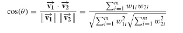

# Search Engine
The project is my final year project using customer care chat as a study case and dataset. The goal is to build a search engine for customer care easily search chat with keyword (query) they have and find related chat.
For implementation algorithm you could see in `app/Libraries/`

## About the project
### Algorithm

This Search engine implement Cosine Similarity and TF-IDF algorithm.

The search engine is implementing Cosine Similarity which measures similarity between query inserted and chat. The calculation of similarity will measure the proximity of the vectors. The vectors represent chat and query as a reference. For compute chat as a vector, which is text-based. The application will be weighted the text using TF – IDF method.

#### Cosine Similarity

Cosine similarity is a metric used to measure how similar the documents are irrespective of their size. Mathematically, it measures the cosine of the angle between two vectors projected in a multi-dimensional space. So, if you have three documents (chat for this case) and querying two terms (keyword for this case). The illustration for vectors in two-dimensional will be something like this.

 

The closer the documents are by angle, the higher is the Cosine Similarity. As you include more terms and documents, it’s harder to visualize a higher-dimensional space. But you can directly compute the cosine similarity using this math formula.

Which 'W1i' is value term 1 from document i and 'W2i' is value term 2 from document i. Therefore, I'm using TF - IDF for giving values to those variables.

#### TF - IDF

For indexing every terms I'm using TF - IDF algorithm. Just like the TF - IDF stand for Term Frequency - Inverse Document Frequency. The formula calculates frequencies of those terms and documents.

### Programming language

In this project, I'm using PHP to cover the website as a platform search engine and calculate the algorithm. I know it's not ideal for using PHP to calculate complex algorithms. But, on the other side I can build the algorithm from scratch and implement it firsthand. ( It's also a challenge from my supervising professors )
