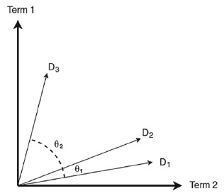

# Search Engine
The project actually is my final year project using customer care chat as study case and dataset. The goal is build an search engine for customer care easily search chat with keyword (query) they have and find related chat.

## About the project
### Algorithm

This Search engine implement Cosine Similarity and TF-IDF algorithm.

The search engine is implementing Cosine Similarity which measure similarity between query inserted and chat. The calculation of similarity will be measure proximity the vectors. The vectors represent chat and query as a reference. For compute chat as a vector, which is text based. The application will be weighted the text using TF – IDF method.

#### Cosine Similarity

Cosine similarity is a metric used to measure how similar the documents are irrespective of their size. Mathematically, it measures the cosine of the angle between two vectors projected in a multi-dimensional space. So, if you have three documents (chat for this case) and querying two terms (keyword for this case). The ilustration for vectors in two dimensional will be something like this.

 

Cosine Similarity is algorithm to measure similarity between vectors. The calculation include measuring proximity between vectors

Mesin Pencarian percakapan/chat menggunakan metode Cosine Similarity dan TF-IDF.

Pencarian dilakukan dengan membandingkan chat yang paling mirip dengan query yang dimasukkan. Perhitungan kemiripan menggunakan cosine similarity. Dimana tingkat kemiripan antara dua buah objek atau berkas chat dengan query dinyatakan dalam vektor. Sehingga sudut nilai cosine dari kedua vektor menyatakan seberapa mirip antara kedua berkas.

Sebuah nilai vektor dari berkas yang berupa kumpulan kalimat dan kata di diapat dengan metode TF-IDF. Metode ini menghitung frekuensi kata pada berkas.
